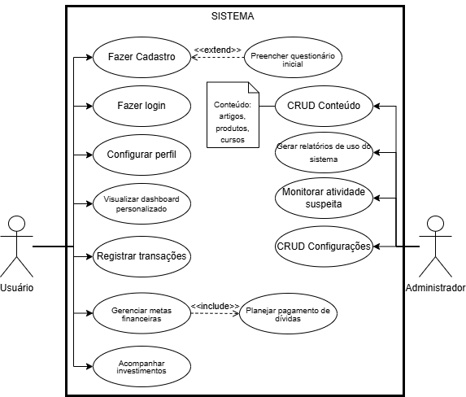

# Especificação do projeto

Pré-requisitos: <a href="01-Contexto.md"> Documentação de contexto</a>

Durante o desenvolvimento do projeto, trabalhamos para identificar problemas e definir o escopo, com base na observação e na pesquisa sobre o público-alvo. Nosso principal objetivo foi reunir o máximo de informações possíveis para compreender e solucionar as dificuldades dos usuários. Para isso, realizamos criamos perspectivas sobre o público-alvo e, após nossa análise, criamos personas que representavam seus hábitos e rotinas. Dessa forma, conseguimos visualizar como a Cash Wise poderia impactar a vida dos usuários. Utilizamos ferramentas para estruturar as personas e o draw.io para desenvolver os Casos de Uso. Além disso, o GitHub Projects foi utilizado para o gerenciamento das tarefas. 

## Personas

**1. João Silva – O Freelancer em Busca de Estabilidade**  
**Perfil Geral:**  
- Idade: 28 anos  
- Profissão: Freelancer de Design Gráfico  
- Contexto: Trabalha de forma autônoma com renda variável e enfrenta dificuldades para separar as finanças pessoais das profissionais.

**Empatia:**  
**O que pensa e sente:**  
- Preocupa-se com a instabilidade financeira e a possibilidade de imprevistos que prejudiquem seu fluxo de caixa.  
- Sonha com uma reserva financeira que permita investir em aprimoramento profissional e segurança no futuro.  
**O que ouve:**  
- Dicas de outros freelancers e influenciadores de finanças pessoais nas redes sociais.  
- Conselhos de colegas sobre métodos de organização e aplicativos de gestão financeira.  
**O que vê:**  
- Notícias sobre economia e investimentos online.  
- Diversos métodos e ferramentas de controle financeiro, mas sente dificuldade em identificar qual se encaixa melhor ao seu perfil.  
**O que diz e faz:**  
- Procura constantemente por soluções práticas e intuitivas para gerenciar seus gastos.  
- Compartilha experiências e busca recomendações em grupos e fóruns de freelancers.  
**Dores:**  
- Falta de disciplina financeira e dificuldade em separar as contas pessoais das profissionais.  
- Medo de não conseguir fazer frente a períodos de baixa demanda.  
**Ganhos:**  
- Acesso a ferramentas simples e dinâmicas para controle financeiro.  
- Dicas práticas e conteúdos que o ajudem a planejar melhor seu orçamento.

**Objetivos:**  
- Organizar seu fluxo de caixa e criar uma reserva de emergência.  
- Aprender técnicas de gestão financeira específicas para freelancers.

**Canais de Informação:**  
- Redes sociais (Instagram, YouTube, grupos no WhatsApp) e blogs especializados em finanças e empreendedorismo.

---

**2. Maria Fernandes – A Empreendedora e Mãe Multitarefas**  
**Perfil Geral:**  
- Idade: 35 anos  
- Profissão: Proprietária de um pequeno negócio e mãe de dois filhos  
- Contexto: Equilibra a gestão de seu empreendimento com as demandas da família e precisa de soluções financeiras rápidas e eficazes.

**Empatia:**  
**O que pensa e sente:**  
- Sente a pressão de manter o negócio saudável enquanto garante a segurança financeira da família.  
- Busca equilíbrio entre sucesso profissional e bem-estar pessoal.  
**O que ouve:**  
- Conselhos de outras mães empreendedoras e especialistas em gestão empresarial.  
- Dicas sobre investimentos e economia doméstica em podcasts e redes sociais.  
**O que vê:**  
- Informações sobre novos métodos de organização financeira e aplicativos de gestão de pequenas empresas.  
- Tendências de mercado que possam impactar seu negócio.  
**O que diz e faz:**  
- Procura soluções que integrem a gestão das finanças pessoais e empresariais.  
- Participa de grupos online e workshops sobre finanças e empreendedorismo.  
**Dores:**  
- Falta de tempo para lidar com planilhas complexas e processos burocráticos.  
- Dificuldade em separar as finanças do negócio das despesas pessoais.  
**Ganhos:**  
- Ferramentas com dashboards intuitivos que ofereçam uma visão rápida do cenário financeiro.  
- Conteúdos educativos que otimizem a gestão financeira tanto pessoal quanto empresarial.

**Objetivos:**  
- Simplificar o acompanhamento diário das finanças.  
- Planejar investimentos para o crescimento do negócio e segurança familiar.

**Canais de Informação:**  
- Redes sociais, newsletters e podcasts de empreendedorismo, além de fóruns de gestão financeira.

---

**3. Lucas Oliveira – O Executivo que Valoriza a Precisão**  
**Perfil Geral:**  
- Idade: 45 anos  
- Profissão: Executivo em uma multinacional  
- Contexto: Enfrenta uma rotina intensa e busca otimizar seus investimentos e planejar uma aposentadoria confortável sem comprometer a eficiência do seu dia a dia.

**Empatia:**  
**O que pensa e sente:**  
- Preocupa-se com a necessidade de diversificar seus investimentos e garantir segurança financeira para a aposentadoria.  
- Valoriza a precisão e clareza na apresentação dos dados.  
**O que ouve:**  
- Relatórios e análises de mercado de fontes confiáveis.  
- Conselhos de consultores financeiros e especialistas em investimentos.  
**O que vê:**  
- Dashboards e ferramentas de monitoramento financeiro com informações em tempo real.  
- Conteúdos avançados sobre estratégias de investimentos e gestão tributária.  
**O que diz e faz:**  
- Prefere soluções que otimizem seu tempo e forneçam dados condensados e estratégicos.  
- Participa de webinars e eventos de networking financeiro.  
**Dores:**  
- Pouco tempo para analisar relatórios extensos e tomar decisões rápidas.  
- Necessidade de informações precisas para ajustar a carteira de investimentos.  
**Ganhos:**  
- Acesso a relatórios personalizados e insights rápidos para decisões informadas.  
- Conteúdos aprofundados que facilitam a compreensão do cenário financeiro.

**Objetivos:**  
- Diversificar sua carteira de investimentos com segurança.  
- Planejar uma aposentadoria tranquila com estratégias financeiras sólidas.

**Canais de Informação:**  
- Portais de notícias financeiras, LinkedIn, webinars e relatórios de mercado.

---

**4. Ana Ribeiro – A Estudante em Busca de Independência**  
**Perfil Geral:**  
- Idade: 22 anos  
- Profissão: Estudante Universitária  
- Contexto: Recém-ingressada na vida adulta, lida com um orçamento limitado e deseja construir uma base financeira sólida enquanto aprende sobre educação financeira.

**Empatia:**  
**O que pensa e sente:**  
- Sente insegurança por não ter experiência na gestão de dinheiro e teme contrair dívidas.  
- Tem o desejo de conquistar independência financeira e planejar um futuro sem apertos.  
**O que ouve:**  
- Conteúdos educativos e dicas práticas sobre finanças pessoais em redes sociais e YouTube.  
- Conselhos de amigos e influenciadores digitais sobre economia para jovens.  
**O que vê:**  
- Aplicativos e ferramentas de planejamento financeiro com interfaces modernas e fáceis de usar.  
- Informações sobre investimentos acessíveis e métodos de poupança.  
**O que diz e faz:**  
- Procura tutoriais que expliquem conceitos financeiros de forma simples.  
- Compartilha dúvidas e experiências em grupos online voltados para jovens e estudantes.  
**Dores:**  
- Falta de experiência e medo de tomar decisões financeiras equivocadas.  
- Orçamento limitado e dificuldade em definir prioridades de gasto.  
**Ganhos:**  
- Ferramentas de simulação financeira que ajudam a montar um orçamento realista.  
- Conteúdos com linguagem acessível e dicas práticas para evitar dívidas.

**Objetivos:**  
- Aprender os fundamentos da gestão financeira.  
- Organizar seu orçamento e construir independência econômica.

**Canais de Informação:**  
- Redes sociais (TikTok, Instagram, YouTube), blogs e comunidades de finanças para jovens.

---

**5. Carla Souza – A Profissional em Transição para Aposentadoria**  
**Perfil Geral:**  
- Idade: 55 anos  
- Profissão: Profissional em transição para aposentadoria  
- Contexto: Está repensando suas finanças para garantir uma aposentadoria tranquila, ajustando hábitos antigos e buscando alternativas de investimentos seguros.

**Empatia:**  
**O que pensa e sente:**  
- Preocupa-se com imprevistos e tem receio de não manter o padrão de vida desejado na aposentadoria.  
- Sente a necessidade de repensar e modernizar seus hábitos de consumo.  
**O que ouve:**  
- Conselhos de especialistas em aposentadoria e informações de amigos e familiares que já passaram pela transição.  
- Notícias e dicas sobre métodos de investimento e economia para a terceira idade.  
**O que vê:**  
- Conteúdos sobre planejamento financeiro para aposentadoria e ferramentas que simulam cenários futuros.  
- Publicações sobre tendências e riscos do mercado financeiro.  
**O que diz e faz:**  
- Busca orientações que ajudem a identificar oportunidades de economia e investimentos adequados ao seu perfil.  
- Participa de workshops e seminários voltados para planejamento de aposentadoria.  
**Dores:**  
- Insegurança quanto à renda futura e medo de imprevistos financeiros.  
- Dificuldade em abandonar hábitos de consumo antigos e ajustá-los ao novo estágio de vida.  
**Ganhos:**  
- Orientações claras e personalizadas sobre investimentos e economia para a aposentadoria.  
- Ferramentas que permitem visualizar cenários futuros e ajustar o planejamento financeiro com facilidade.

**Objetivos:**  
- Reorganizar as finanças para garantir uma aposentadoria sem surpresas.  
- Investir de forma consciente e reduzir gastos supérfluos sem comprometer a qualidade de vida.

**Canais de Informação:**  
- Sites especializados em aposentadoria, fóruns online, grupos no Facebook e publicações em revistas financeiras.

## Histórias de usuários

Com base na análise das personas, foram identificadas as seguintes histórias de usuários:

**EU COMO... PERSONA** | **QUERO/PRECISO... FUNCIONALIDADE** | **PARA... MOTIVO/VALOR**
--- | --- | ---
**João Silva** | Receber notificações automáticas sobre dicas de mercado financeiro e status das minhas organizações e operações financeiras. | Acompanhar meu progresso financeiro de forma fidedigna que me permita tomada de decisão baseadas nos gráficos e estatísticas sobre meus recursos financeiros.
**Maria Fernandes** | Integrar a gestão das finanças pessoais e empresariais em dashboards intuitivos, para oferecer uma visão robusta. | Traçar estratégias para redução de custos e planejar investimentos rápidos do cenário financeiro.
**Lucas Oliveira** | Receber conteúdos avançados sobre estratégias de investimentos e gestão tributária. | Analisar relatórios automatizados com sugestões personalizadas para guiar em ações e facilitar o direcionamento nas decisões.
**Ana Ribeiro** | Utilizar interfaces modernas e fáceis de usar, com informações sobre investimentos acessíveis e métodos de aplicações personalizadas. | Ganhar experiência e perder medo de tomar decisões financeiras que possam comprometer o cotidiano.
**Carla Souza** | Receber conteúdos sobre planejamento financeiro para aposentadoria e ferramentas que simulam cenários futuros. | Aprender a analisar a renda futura e reduzir/evitar imprevistos financeiros.

Apresente aqui as histórias de usuários que são relevantes para o projeto da sua solução. As histórias de usuários consistem em uma ferramenta poderosa para a compreensão e elicitação dos requisitos funcionais e não funcionais da sua aplicação. Se possível, agrupe as histórias de usuários por contexto, para facilitar consultas recorrentes a esta parte do documento.

## Requisitos

As tabelas a seguir apresentam os requisitos funcionais e não funcionais que detalham o escopo do projeto. Para determinar a prioridade dos requisitos, aplique uma técnica de priorização e detalhe como essa técnica foi aplicada.

### Requisitos funcionais

| ID    | Descrição do Requisito                                                                 | Prioridade |
|-------|-----------------------------------------------------------------------------------------|------------|
| RF-001| Gestão de cadastro de usuário     | ALTA       |
| RF-002| Gestão de entrada e saídas de informações | ALTA       |
| RF-003| O sistema deve definir o tipo de perfil financeiro do usuário| MÉDIA      |
| RF-004|  Gestão de gastos mensais  | MÉDIA      |
| RF-005|  Criação de dashboard com informações financeiras do usuário | MÉDIA      |
| RF-006| O sistema deve mostrar opções de conteúdos financeiros como Mercado de Capitais e investimentos padrão | MÉDIA   |
| RF-007| Sugerir estratégias de investimentos | MÉDIA      |

### Requisitos não funcionais

|ID     | Descrição do Requisito  |Prioridade |
|-------|-------------------------|----|
|RNF-001| O sistema deve ser responsivo para rodar em dispositivos móveis | MÉDIA | 
|RNF-002| Deve processar as requisições do usuário em no máximo 3 segundos |  BAIXA | 
|RNF-003| O site deve funcionar corretamente em diferentes navegadores e sistemas operacionais, garantindo que todos os usuários tenham uma experiência consistente | MÉDIA | 
|RNF-004| O sistema deve garantir a integridade dos dados, prevenindo a perda ou corrupção de informações | MÉDIA | 
|RNF-005| A interface da aplicação deve ser intuitiva e fácil de usar, independentemente do nível de habilidade do usuário com tecnologia. | ALTA |
|RNF-006| O código deve ser modular e bem documentado para facilitar futuras manutenções, atualizações e possíveis expansões de funcionalidades, permitindo que desenvolvedores possam facilmente compreender e modificar o sistema. | ALTA |
|RNF-007| O sistema deve usar os recursos de hardware de forma eficaz, sem desperdício de energia ou capacidade.| ALTA |
|RNF-008| O sistema deve ser desenvolvido em NodeJs, com banco de dados MySQL e hospedagem Azure | ALTA |

Com base nas histórias de usuários, enumere os requisitos da sua solução. Classifique esses requisitos em dois grupos:

- [Requisitos funcionais
 (RF)](https://pt.wikipedia.org/wiki/Requisito_funcional):
 correspondem a uma funcionalidade que deve estar presente na
  plataforma (ex: cadastro de usuário).
- [Requisitos não funcionais
  (RNF)](https://pt.wikipedia.org/wiki/Requisito_n%C3%A3o_funcional):
  correspondem a uma característica técnica, seja de usabilidade,
  desempenho, confiabilidade, segurança ou outro (ex: suporte a
  dispositivos iOS e Android).

Lembre-se de que cada requisito deve corresponder a uma e somente uma característica-alvo da sua solução. Além disso, certifique-se de que todos os aspectos capturados nas histórias de usuários foram cobertos.

## Restrições

O projeto está restrito aos itens apresentados na tabela a seguir.

|ID| Restrição                                             |
|--|-------------------------------------------------------|
|001| O projeto deverá ser entregue até o final do semestre |
|002| O custo total do projeto não deve exceder o orçamento definido |

## Diagrama de casos de uso

O Diagrama de Casos de Uso apresenta as principais interações entre os atores e o sistema, destacando as funcionalidades disponíveis para cada perfil de usuário. Ele define as ações que podem ser realizadas pelo Administrador, incluindo a gestão de usuários, controle de conteúdo, configuração do sistema, monitoramento de atividades e suporte técnico. Esse diagrama auxilia na visualização dos requisitos funcionais do sistema, garantindo uma compreensão clara das permissões e responsabilidades de cada ator envolvido.

