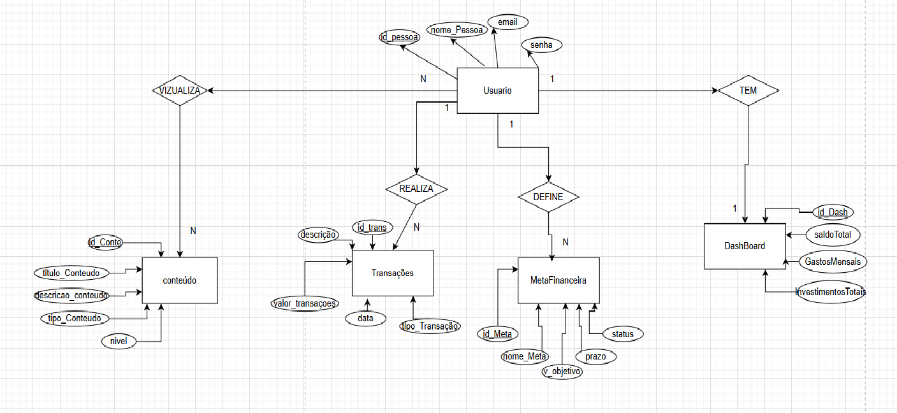
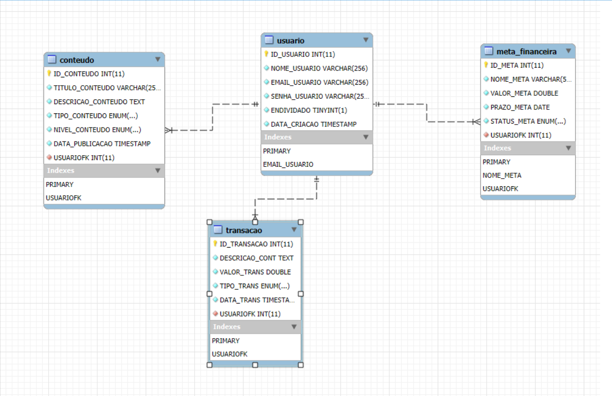

# Arquitetura da solução

<span style="color:red">Pré-requisitos: <a href="04-Projeto-interface.md"> Projeto de interface</a></span>

Definição de como o software é estruturado em termos dos componentes que fazem parte da solução e do ambiente de hospedagem da aplicação.


## Diagrama de classes

##  Modelo de dados




### Esquema relacional




### Modelo físico
```sql
CREATE DATABASE BD_CASHWISE;
USE BD_CASHWISE;
CREATE TABLE USUARIO (
    ID_USUARIO INT NOT NULL AUTO_INCREMENT PRIMARY KEY,
    NOME_USUARIO VARCHAR(256) NOT NULL,
    EMAIL_USUARIO VARCHAR(256) NOT NULL UNIQUE,
    SENHA_USUARIO VARCHAR(255) NOT NULL,
    ENDIVIDADO BOOLEAN NOT NULL,
    DATA_CRIACAO TIMESTAMP DEFAULT CURRENT_TIMESTAMP
);

CREATE TABLE CONTEUDO (
    ID_CONTEUDO INT NOT NULL AUTO_INCREMENT PRIMARY KEY,
    TITULO_CONTEUDO VARCHAR(256) NOT NULL,
    DESCRICAO_CONTEUDO TEXT NOT NULL,
    TIPO_CONTEUDO ENUM('INVESTIMENTO','ECONOMIA','VALORIZACAO') NOT NULL,
    NIVEL_CONTEUDO ENUM('INICIANTE','INTERMEDIARIO','AVANCADO') NOT NULL,
    DATA_PUBLICACAO TIMESTAMP DEFAULT CURRENT_TIMESTAMP,
    USUARIOFK INT NOT NULL,
    FOREIGN KEY (USUARIOFK) REFERENCES USUARIO (ID_USUARIO)
    ON DELETE CASCADE 
    ON UPDATE CASCADE
    );

CREATE TABLE META_FINANCEIRA (
	ID_META INT NOT NULL AUTO_INCREMENT PRIMARY KEY,
    NOME_META VARCHAR (56) NOT NULL UNIQUE ,
    VALOR_META DOUBLE NOT NULL,
    PRAZO_META DATE NOT NULL,
    STATUS_META ENUM ('SIGA EM FRENTE', ' QUASE LA', 'CONCLUIDO') NOT NULL,
    USUARIOFK INT NOT NULL,
    FOREIGN KEY (USUARIOFK) REFERENCES USUARIO (ID_USUARIO)
    ON DELETE CASCADE 
    ON UPDATE CASCADE
    );

CREATE TABLE TRANSACAO (
	ID_TRANSACAO INT NOT NULL AUTO_INCREMENT PRIMARY KEY,
    DESCRICAO_CONT TEXT NOT NULL,
    VALOR_TRANS DOUBLE NOT NULL,
    TIPO_TRANS ENUM ('RECEITA' , 'DESPESA') NOT NULL,
    DATA_TRANS TIMESTAMP DEFAULT CURRENT_TIMESTAMP,
    USUARIOFK INT NOT NULL,
    FOREIGN KEY (USUARIOFK) REFERENCES USUARIO (ID_USUARIO)
    ON DELETE CASCADE
    ON UPDATE CASCADE
    );
    
CREATE TABLE DASHBOARD (
ID_DASH INT NOT NULL AUTO_INCREMENT PRIMARY KEY,
USUARIOFK INT NOT NULL,
SALDOTOTAL_DASH DOUBLE NOT NULL, 
GASTOSMENSAIS_DASH DOUBLE NOT NULL,
INVESTIMENTOTOTAIS_DASH DOUBLE NOT NULL, 
FOREIGN KEY (USUARIOFK) REFERENCES USUARIO (ID_USUARIO)
    ON DELETE CASCADE
    ON UPDATE CASCADE
    );
```
 [script Sql](../src/db/mdf_Sql).


## Tecnologias

| **Dimensão**   | **Tecnologia**  |
| ---            | ---             |
| Front-end      | HTML + CSS + JS |
| Back-end       | C#         |
| SGBD           | MySQL           |
| Deploy         | AWS          |


## Hospedagem

Explique como a hospedagem e o lançamento da plataforma foram realizados.


## Qualidade de software

Para assegurar que a aplicação atenda às expectativas dos usuários, adotamos práticas com base na norma ISO/IEC 25010, que define características essenciais de qualidade em software.

🔹 Funcionalidade (Adequação Funcional)
A aplicação oferece funcionalidades completas para gerenciar receitas, despesas e investimentos com precisão.
Prática: Desenvolvimento orientado a testes para validar os cálculos e operações financeiras.

🔹 Confiabilidade (Reliability)
A arquitetura é robusta, garantindo disponibilidade mesmo em falhas ou picos de acesso.
Prática: Monitoramento contínuo e mecanismos de redundância.

🔹 Usabilidade (Usability)
A interface é responsiva e intuitiva, atendendo usuários com diferentes perfis.
Prática: Testes de usabilidade e coleta de feedback para melhorias constantes.

🔹 Eficiência de Desempenho (Performance Efficiency) O desempenho da aplicação é otimizado para garantir respostas rápidas. Prática: Implementação de caching e otimização de consultas.

🔹 Manutenibilidade (Maintainability) O código é modular e bem documentado, facilitando atualizações. Prática: Boas práticas de programação e testes automatizados.

🔹 Segurança (Security) Os dados são protegidos por autenticação forte e criptografia. Prática: Monitoramento de vulnerabilidades e aplicação de atualizações de segurança.

🔹 Compatibilidade (Compatibility) A aplicação funciona em diversos dispositivos e navegadores. Prática: Testes multiplataforma durante o desenvolvimento.

🔹 Portabilidade (Portability) É possível implantar a aplicação em diferentes ambientes, como servidores locais e nuvem. Prática: Uso de contêineres para facilitar a migração.

